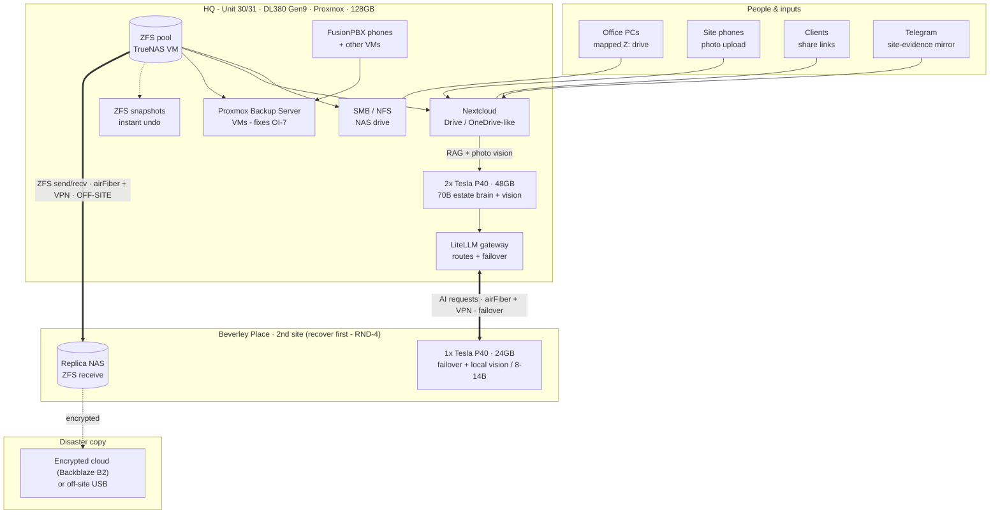

# Estate vision — one picture (RND-2 + RND-3 + RND-4)

_R&D synthesis, 2026-10-04 (Creative mode). The private, two-site, self-hosted estate: storage +
backup + AI, all on kit Fishbone owns. Diagram: `estate-vision.mmd` (rendered to Minda). Still
research — each layer graduates to a real runbook + OI on Minda's go. Guide-only throughout; no secret
held; production PBX never at risk._

## How to read it
- **Inputs (left):** office PCs on a mapped drive; **site phones auto-uploading photos**; clients via
  share links; the **Telegram site-evidence mirror** — all land in one store.
- **HQ (the keep):** one **ZFS pool** with two faces — **SMB/NFS** (NAS) + **Nextcloud** (Drive/
  OneDrive-like). **Backup chain:** ZFS snapshots (instant undo) + **Proxmox Backup Server** for the VMs
  (**fixes OI-7**). **AI:** **2× Tesla P40 = 48 GB** running a **70B estate brain + live vision**, fed by
  the store via **RAG + photo tagging**, fronted by a **LiteLLM gateway**.
- **Beverley Place (the second castle, RND-4):** **replica NAS** (ZFS receive) + **1× P40** as the
  **AI failover / local vision** node.
- **Between sites:** the existing **airFiber bridge + IPsec VPN** carries **ZFS replication** (off-site
  backup) and **AI request routing/failover** — pooled *within* a box, routed *across* sites.
- **Disaster copy:** encrypted cloud (Backblaze B2) or off-site USB.

## The shape of it
- **Data: 3-2-1** — pool → off-site replica → encrypted disaster copy (+ snapshots + PBS).
- **AI: 2-site redundancy** — HQ 70B brain; Beverley failover; if one castle falls, the other keeps
  thinking and the data's already there.
- **All private** — estate data never leaves the buildings; no per-token bills; nobody can switch it off.

## The build order (when it graduates)
1. **RND-4** — recover Beverley Place (start: UniFi-controller recon).
2. **RND-3** — storage + backup foundation, both sites (the first real brick).
3. **RND-2** — local AI: CPU first, then 2× P40 at HQ + 1 at Beverley, routed via the gateway.

